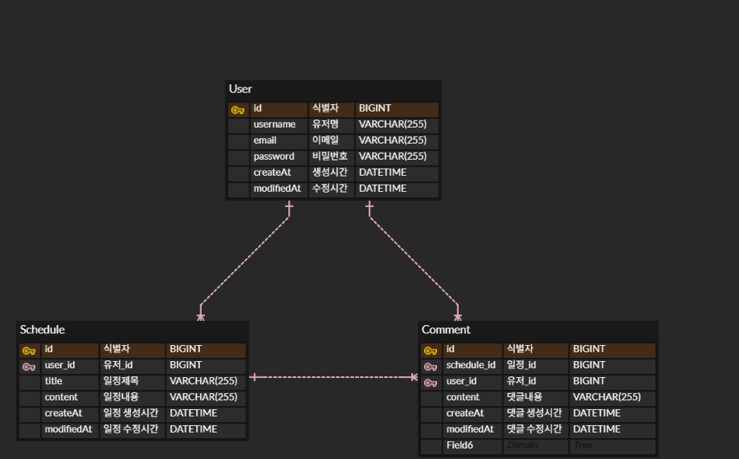

# API 명세

### 1. 유저(User) API

#### 1.1 회원가입

| 항목 | 내용 |
| --- | --- |
| **URL** | `POST /users` |
| **Request Body** | `username` (String, 필수, 최대 4자)   `email` (String, 필수, 이메일 형식)   `password` (String, 필수, 최소 8자) |
| **Response** | `201 Created` |
| **Response Body** | `id`, `username`, `email`, `createdAt`, `modifiedAt` |
| **Error** | `400 Bad Request` - 필수값 누락, 비밀번호 8자 미만, 이메일 형식 오류 |

#### 1.2 유저 목록 조회

| 항목 | 내용 |
| --- | --- |
| **URL** | `GET /users` |
| **Response** | `200 OK` |
| **Response Body** | 유저 목록 배열 (`id`, `username`) |

#### 1.3 유저 단건 조회

| 항목 | 내용 |
| --- | --- |
| **URL** | `GET /users/{userId}` |
| **Path Variable** | `userId` (Long, 필수) |
| **Response** | `200 OK` |
| **Response Body** | `id`, `username`, `email`, `createdAt`, `modifiedAt` |
| **Error** | `404 Not Found` - 존재하지 않는 유저 |

#### 1.4 유저 수정

| 항목 | 내용 |
| --- | --- |
| **URL** | `PUT /users/{userId}` |
| **Path Variable** | `userId` (Long, 필수) |
| **Request Body** | `username` (String, 필수)   `email` (String, 필수) |
| **Response** | `200 OK` |
| **Response Body** | `id` |
| **Error** | `404 Not Found` - 존재하지 않는 유저 |
| **비고** | 비밀번호는 수정 대상에서 제외 |

#### 1.5 유저 삭제

| 항목 | 내용 |
| --- | --- |
| **URL** | `DELETE /users/{userId}` |
| **Path Variable** | `userId` (Long, 필수) |
| **Response** | `204 No Content` |
| **Error** | `404 Not Found` - 존재하지 않는 유저 |

---

### 2. 인증(Login) API

#### 2.1 로그인

| 항목 | 내용 |
| --- | --- |
| **URL** | `POST /login` |
| **Request Body** | `email` (String, 필수)   `password` (String, 필수) |
| **Response** | `200 OK` |
| **Response Body** | `id`, `username` |
| **Error** | `401 Unauthorized` - 이메일 또는 비밀번호 불일치 |
| **비고** | 응답 헤더에 `Set-Cookie: JSESSIONID` 발급, 이후 요청은 세션으로 인증 |

#### 2.2 로그아웃

| 항목 | 내용 |
| --- | --- |
| **URL** | `POST /logout` |
| **Response** | `200 OK` |
| **비고** | 서버의 세션을 무효화(invalidate) 처리 |

---

### 3. 일정(Schedule) API

#### 3.1 일정 생성

| 항목 | 내용 |
| --- | --- |
| **URL** | `POST /schedules` |
| **Request Body** | `userId` (Long, 필수)   `title` (String, 필수, 최대 10자)   `content` (String, 필수) |
| **Response** | `201 Created` |
| **Response Body** | `id`, `username`, `title`, `content`, `createdAt`, `modifiedAt` |
| **Error** | `404 Not Found` - 존재하지 않는 유저   `400 Bad Request` - 제목 10자 초과, 필수값 누락 |

#### 3.2 일정 목록 조회

| 항목 | 내용 |
| --- | --- |
| **URL** | `GET /schedules` |
| **Query Parameter** | `name` (String, 선택) - 작성 유저명으로 필터링 |
| **Response** | `200 OK` |
| **Response Body** | 일정 목록 배열 (`id`, `title`) |

#### 3.3 일정 단건 조회

| 항목 | 내용 |
| --- | --- |
| **URL** | `GET /schedules/{scheduleId}` |
| **Path Variable** | `scheduleId` (Long, 필수) |
| **Response** | `200 OK` |
| **Response Body** | `id`, `username`, `title`, `content`, `createdAt`, `modifiedAt` |
| **Error** | `404 Not Found` - 존재하지 않는 일정 |

#### 3.4 일정 수정

| 항목 | 내용 |
| --- | --- |
| **URL** | `PUT /schedules/{scheduleId}` |
| **Path Variable** | `scheduleId` (Long, 필수) |
| **Request Body** | `title` (String, 필수, 최대 10자)   `content` (String, 필수) |
| **Response** | `200 OK` |
| **Response Body** | `id` |
| **Error** | `404 Not Found` - 존재하지 않는 일정   `400 Bad Request` - 제목 10자 초과 |
| **비고** | 작성 유저는 수정 대상에서 제외 |

#### 3.5 일정 삭제

| 항목 | 내용 |
| --- | --- |
| **URL** | `DELETE /schedules/{scheduleId}` |
| **Path Variable** | `scheduleId` (Long, 필수) |
| **Response** | `204 No Content` |
| **Error** | `404 Not Found` - 존재하지 않는 일정 |

#### 3.6 일정 페이징 조회

| 항목 | 내용 |
| --- | --- |
| **URL** | `GET /schedules/page` |
| **Query Parameter** | `page` (int, 선택, 기본값 0)   `size` (int, 선택, 기본값 10)   `sort` (String, 선택, 기본값 modifiedAt,desc) |
| **Response** | `200 OK` |
| **Response Body** | `content`(`id`, `username`, `title`, `content`, `commentCount`, `createdAt`, `modifiedAt` 배열), `totalElements`, `totalPages`, `number` |
| **비고** | 일정 수정일(`modifiedAt`) 기준 내림차순 정렬이 기본값 |

---

### 4. 댓글(Comment) API

#### 4.1 댓글 생성

| 항목 | 내용 |
| --- | --- |
| **URL** | `POST /comments` |
| **Request Body** | `scheduleId` (Long, 필수)   `userId` (Long, 필수)   `content` (String, 필수) |
| **Response** | `201 Created` |
| **Response Body** | `id`, `username`, `content`, `createdAt`, `modifiedAt` |
| **Error** | `404 Not Found` - 존재하지 않는 일정 또는 유저   `400 Bad Request` - 댓글 내용 누락 |

#### 4.2 댓글 목록 조회

| 항목 | 내용 |
| --- | --- |
| **URL** | `GET /comments` |
| **Response** | `200 OK` |
| **Response Body** | 댓글 목록 배열 (`id`, `username`, `content`, `createdAt`) |

---

## ERD (Entity Relationship Diagram)

